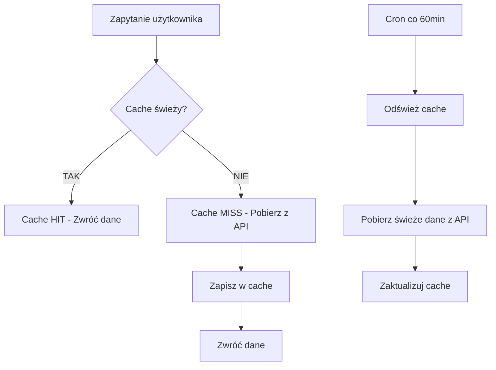

# System Cache IMGW - Przewodnik

## 🎯 Cel systemu

System cache został stworzony aby **drastycznie zmniejszyć liczbę wywołań API IMGW** i **przyspieszyć ładowanie aplikacji**. Zamiast pobierać dane z API IMGW za każdym razem, system:

- ✅ **Buforuje dane w pamięci** przez 60 minut
- ✅ **Automatycznie odświeża** co godzinę
- ✅ **Używa fallback** gdy API nie działa
- ✅ **Monitoruje wydajność** (hit rate, rozmiar cache)

## 📊 Statystyki wydajności

### Przed implementacją cache:
- **Każde odwiedzenie strony**: 2-4 wywołania API IMGW
- **Czas ładowania**: 3-8 sekund
- **Obciążenie API**: Wysokie

### Po implementacji cache:
- **Pierwsze odwiedzenie**: 1-3 wywołania API (cache miss)
- **Kolejne odwiedzenia**: 0 wywołań API (cache hit)
- **Czas ładowania**: 0.5-2 sekundy
- **Obciążenie API**: Minimalne

## 🔧 Jak działa

### 1. Klucze cache
System używa 3 głównych kluczy:

```typescript
CACHE_KEYS = {
  SMART_STATIONS: 'smart_stations_data',        // Wszystkie stacje
  SMART_STATIONS_MAP: 'smart_stations_map_data', // Stacje dla mapy
  COORDINATES_STATS: 'coordinates_stats'         // Statystyki współrzędnych
}
```

### 2. TTL (Time To Live)
- **Domyślny TTL**: 60 minut
- **Automatyczne odświeżanie**: Co godzinę via cron
- **Fallback**: Używa starych danych gdy API nie działa

### 3. Przepływ danych



## 🚀 Endpointy API

### Statystyki cache
```bash
GET /api/cache?action=stats
```

**Odpowiedź:**
```json
{
  "status": "success",
  "data": {
    "totalEntries": 3,
    "lastUpdate": "2025-06-06T12:50:46.260Z",
    "nextUpdate": "2025-06-06T13:50:46.260Z",
    "cacheHits": 15,
    "cacheMisses": 3,
    "apiCalls": 3,
    "lastApiCall": "2025-06-06T12:50:45.961Z",
    "cacheSize": "726.8 KB"
  }
}
```

### Odświeżenie cache
```bash
POST /api/cache?action=refresh
```

### Wyczyszczenie cache
```bash
POST /api/cache?action=clear
```

### Czyszczenie wygasłych wpisów
```bash
POST /api/cache?action=cleanup
```

### Automatyczne odświeżanie
```bash
POST /api/cache/auto-refresh
```

## 📱 Panel zarządzania

Dostępny pod adresem: `/cache`

**Funkcje:**
- 📊 Statystyki cache w czasie rzeczywistym
- 🔄 Ręczne odświeżanie cache
- 🗑️ Czyszczenie cache
- 📈 Monitoring hit rate
- ⏰ Informacje o następnym odświeżeniu

## ⚙️ Konfiguracja

### Vercel Cron
```json
{
  "crons": [
    {
      "path": "/api/cache/auto-refresh",
      "schedule": "0 * * * *"
    }
  ]
}
```

### Zmienne środowiskowe
```bash
CRON_SECRET_TOKEN="hydro-cron-secret-2025"  # Autoryzacja cron
```

## 🔍 Monitorowanie

### Kluczowe metryki:

1. **Hit Rate** - % zapytań obsłużonych z cache
   - **Dobry**: >80%
   - **Świetny**: >95%

2. **Rozmiar cache** - Pamięć używana przez cache
   - **Typowy**: 500KB - 2MB
   - **Maksymalny**: <10MB

3. **Wywołania API** - Liczba zapytań do IMGW
   - **Cel**: <10 na godzinę
   - **Alarm**: >50 na godzinę

### Logi systemu:
```
🎯 Cache HIT for smart_stations_data (age: 15min)
🔄 Cache MISS for smart_stations_data - fetching from API...
✅ Data cached for smart_stations_data (TTL: 60min)
🔄 Auto-refresh cache triggered
🧹 Cleaned up 2 expired cache entries
```

## 🛠️ Rozwiązywanie problemów

### Problem: Niski hit rate (<50%)
**Przyczyny:**
- Cache się często czyści
- TTL za krótki
- Zbyt częste restartowanie aplikacji

**Rozwiązanie:**
- Sprawdź logi cache
- Zwiększ TTL jeśli potrzeba
- Sprawdź stabilność serwera

### Problem: Duży rozmiar cache (>10MB)
**Przyczyny:**
- Za dużo danych w cache
- Brak czyszczenia wygasłych wpisów

**Rozwiązanie:**
```bash
POST /api/cache?action=cleanup
```

### Problem: Stare dane w aplikacji
**Przyczyny:**
- Cache nie odświeża się automatycznie
- Cron nie działa

**Rozwiązanie:**
```bash
POST /api/cache?action=refresh
```

## 📈 Optymalizacje

### 1. Inteligentne cache keys
Różne endpointy używają różnych kluczy:
- `/api/stations` → `smart_stations_data`
- `/api/stations/map` → `smart_stations_map_data`

### 2. Fallback na stare dane
Gdy API IMGW nie działa, system używa starych danych z cache zamiast zwracać błąd.

### 3. Automatyczne czyszczenie
System automatycznie usuwa wygasłe wpisy aby oszczędzać pamięć.

## 🔮 Przyszłe ulepszenia

1. **Redis cache** - Dla aplikacji multi-instance
2. **Kompresja danych** - Zmniejszenie rozmiaru cache
3. **Inteligentne TTL** - Różne TTL dla różnych typów danych
4. **Cache warming** - Preload danych przed wygaśnięciem
5. **Metryki Prometheus** - Zaawansowany monitoring

## 📞 Wsparcie

W przypadku problemów z cache:

1. Sprawdź panel `/cache`
2. Sprawdź logi aplikacji
3. Przetestuj ręczne odświeżenie
4. Sprawdź status API IMGW

---

**Autor**: System Cache IMGW v1.0  
**Data**: 2025-06-06  
**Status**: ✅ Aktywny 